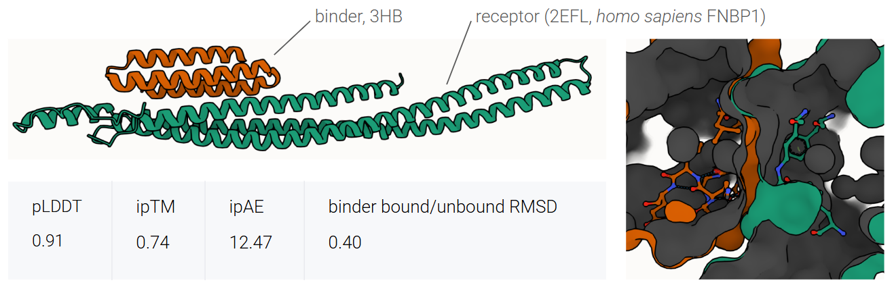
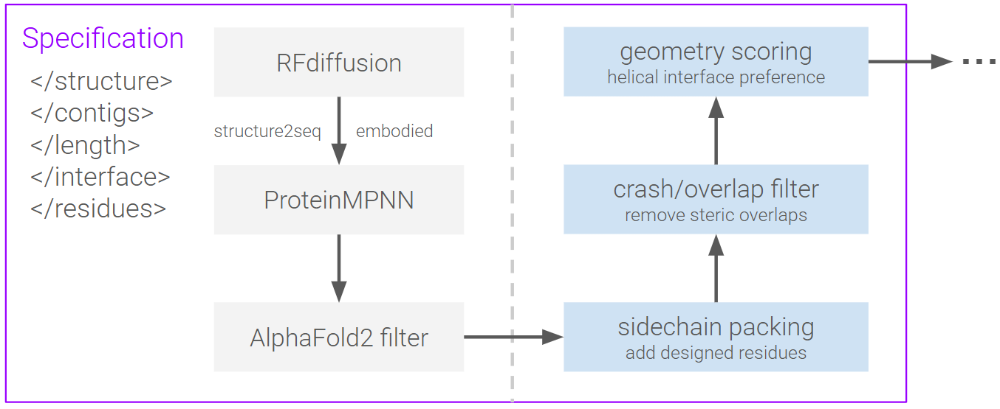

# Diffusion-model based protein binder design pipeline

A minimal ML–driven pipeline for de novo protein binder generation using structure-conditioned generative models.

This repository implements a modular workflow combining RFdiffusion for backbone generation, ProteinMPNN for sequence design, and AlphaFold2 for structure validation.

Additional geometric filters are applied to prioritize structurally plausible helical interfaces.

# Example design

An example designed binder targeting **human FNBP1 (PDB: 2EFL)** is shown below.

The generated binder forms a **three-helix bundle (3HB)** that packs against the receptor interface.

AlphaFold-based complex prediction metrics:

| metric | value |
|------|------|
| pLDDT | 0.91 |
| ipTM | 0.74 |
| ipAE | 12.47 |
| binder bound/unbound RMSD | 0.40 |

These metrics suggest a stable binder conformation with a consistent predicted binding mode.

---

# Pipeline overview

The design workflow combines diffusion-based structure generation with neural sequence design and structural filtering.

Additional structural filters improve design quality:

**Sidechain packing**

Adds designed residues and reconstructs sidechain geometry.

**Clash / overlap filtering**

Removes designs with steric clashes or unrealistic packing.

**Geometry scoring**

Prioritizes interfaces consistent with **helical packing motifs**.

---

# Repository Structure

protein-design-pipeline

configs/ RFdiffusion design specifications
scripts/ execution scripts
parent/ receptor structures
models/ RFdiffusion checkpoints
images/ container images
docs/ figures and descriptions

outputs/ generated backbones and designs
logs/ job logs

---

# Running the Pipeline

Example SLURM submission:

sbatch scripts/run_rfdiffusion.sh configs/headtail.txt

Each SLURM array task samples independent diffusion trajectories using different random seeds.

---

# Requirements

- RFdiffusion  
- ProteinMPNN  
- AlphaFold2  
- PyTorch  
- Apptainer / Singularity  
- GPU-enabled HPC environment

---

# References

RFdiffusion  
Watson et al. *Nature* (2023)  
https://doi.org/10.1038/s41586-023-06415-8

ProteinMPNN  
Dauparas et al. *Science* (2022)  
https://doi.org/10.1126/science.add2187

AlphaFold2  
Jumper et al. *Nature* (2021)  
https://doi.org/10.1038/s41586-021-03819-2