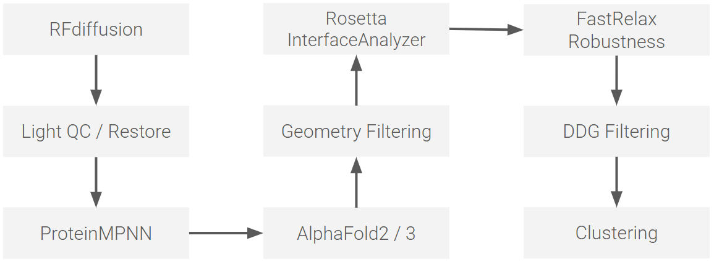
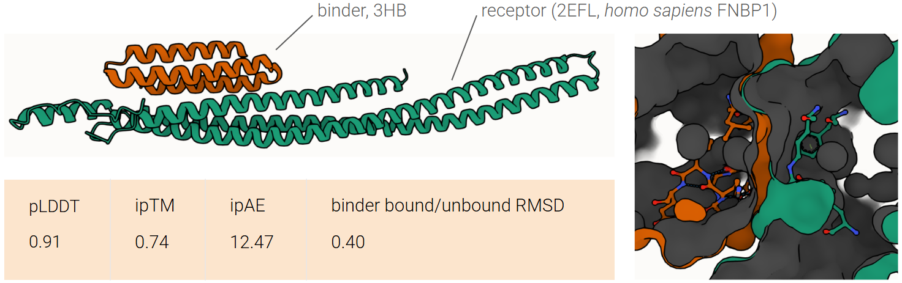

# binderdesign-cuilab

`binderdesign-cuilab` is a package for de novo protein binder design and large-scale screening,
combining generative modeling (RFdiffusion), sequence design (ProteinMPNN),
structure prediction (AlphaFold2/3), and physics-based evaluation (Rosetta).

This repository is a part of ongoing research efforts in ADC design and
molecular modeling of tissue transglutaminase 2 (TG2) family and transducer of cdc42-dependent actin assembly (Toca) family in the [Cui Lab](https://cuilab.stanford.edu/research),
Stanford University.



The library is designed for Stanford Marlowe, but it also installs locally as a normal Python package.

## Update 260408

- Project orchestration: `binderdesign-cuilab project ...` or top-level `binderdesign-cuilab run-project ...`
- Table utilities: `binderdesign-cuilab table ...`
- Slurm workers: `scripts/marlowe/*.sh`

Legacy implementation directories such as `workflow/`, `triage/`, and `sidechain_restore/` have been retired from the runtime path and should not be used.

## Python Dependencies

Installed through `pyproject.toml`:

- `numpy>=1.24`
- `gemmi>=0.6`

`gemmi` is kept to support mmCIF parsing, which is useful for AlphaFold3-style outputs.

## External Runtime Dependencies

These are not Python packages; they must exist in your Marlowe environment or module setup:

- RFdiffusion
- ProteinMPNN
- AlphaFold2 or ColabFold, and/or AlphaFold3
- Rosetta executables plus Rosetta database
- Slurm
- optional: Apptainer

## Install Locally

### PowerShell

```powershell
.\scripts\bootstrap_local.ps1
```

### Bash

```bash
bash scripts/bootstrap_local.sh
```

That creates:

- `.venv/`
- editable install of `binderdesign-cuilab`
- entry points `binderdesign-cuilab` and `binderdesign-cuilab-table`

## CLI Entry Points

Top-level project commands:

```bash
binderdesign-cuilab init-project --help
binderdesign-cuilab run-project --help
binderdesign-cuilab submit-marlowe --help
```

Lower-level interfaces:

```bash
binderdesign-cuilab table --help
binderdesign-cuilab task --help
```

## Usage

Create and submit a project:

```bash
binderdesign-cuilab run-project \
  --name demo \
  --target-pdb /path/to/target.pdb \
  --target-chain A \
  --binding-region A159,A161,A162,A163,A164,A165,A166,A167,A169 \
  --binder-length-min 60 \
  --binder-length-max 80 \
  --num-seeds 4 \
  --num-designs-per-seed 100 \
  --af-backend af2 \
  --submit-marlowe
```

Dry-run the submission logic:

```bash
binderdesign-cuilab run-project \
  --name demo_dryrun \
  --target-pdb /path/to/target.pdb \
  --target-chain A \
  --binding-region A159,A161,A162,A163,A164,A165,A166,A167,A169 \
  --submit-marlowe \
  --dry-run
```



## Project Layout

Each project under `projects/<name>/` contains:

```text
project.json
inputs/
configs/
outputs/
tables/
stage_tables/
manifests/
stage_results/
af_fastas/
```

Key outputs:

- `tables/master.final.tsv`
- `stage_tables/final_picks.tsv`

## Marlowe Environment Variables

### Core Slurm / Marlowe

```bash
export MARLOWE_PROJECT_ID=</project_id>
export MARLOWE_ACCOUNT=</account>
export MARLOWE_PARTITION=preempt or batch
```

### RFdiffusion

```bash
export RFDIFFUSION_PYTHON=/path/to/env/bin/python
export RFDIFFUSION_SCRIPT=/path/to/RFdiffusion/scripts/run_inference.py
```

Optional:

- `RFDIFFUSION_MODEL_DIR`
- `RFDIFFUSION_CKPT_PATH`
- `RFDIFFUSION_EXTRA_ARGS`
- `RFDIFFUSION_SIF`

### ProteinMPNN

```bash
export PROTEINMPNN_PYTHON=/path/to/env/bin/python
export PROTEINMPNN_SCRIPT=/path/to/ProteinMPNN/protein_mpnn_run.py
```

Optional:

- `MPNN_PDB_COLUMN`
- `MPNN_DESIGN_CHAINS`
- `MPNN_NUM_SEQ_PER_TARGET`
- `MPNN_SAMPLING_TEMP`
- `MPNN_BATCH_SIZE`
- `MPNN_EXTRA_ARGS`
- `PROTEINMPNN_SIF`

### AlphaFold2

```bash
export AF2_BATCH_CMD=colabfold_batch
```

Optional:

- `AF2_MODEL_TYPE`
- `AF2_EXTRA_ARGS`
- `AF2_SIF`
- `COLABFOLD_CMD`
- `COLABFOLD_MODEL_TYPE`
- `COLABFOLD_EXTRA_FLAGS`
- `COLABFOLD_SIF`

### AlphaFold3

With a Marlowe-usable AF3 wrapper that accepts:

```text
AF3 wrapper <input_fasta> <output_dir>
```

```bash
export AF3_CMD=/path/to/af3_wrapper
```

or:

```bash
export AF3_PYTHON=/path/to/env/bin/python
export AF3_SCRIPT=/path/to/af3_wrapper.py
```

Optional:

- `AF3_MODEL_TYPE`
- `AF3_EXTRA_ARGS`
- `AF3_SIF`

### Rosetta

```bash
export ROSETTA_BIN=/path/to/rosetta/main/source/bin
export ROSETTA_DB=/path/to/rosetta/main/database
```

Optional:

- `ROSETTA_INTERFACE`
- `ROSETTA_SIF`
- `ROSETTA_ROSETTASCRIPTS_BIN`
- `ROSETTA_FASTRELAX_BIN`
- `ROSETTA_RELAX_XML`
- `ROSETTA_DDG_BIN`
- `ROSETTA_DDG_EXTRA_ARGS`

Kept intentionally:

- `rosetta/relax_interface.xml`
- `rosetta/repack_interface.xml`

`relax_interface.xml` is the default protocol for the FastRelax robustness stage unless you override `ROSETTA_RELAX_XML`.

## Marlowe Slurm Scripts

All worker scripts now call the Python library instead of duplicating stage logic in bash:

- `scripts/marlowe/common.sh`
- `scripts/marlowe/run_rfdiffusion_array.sh`
- `scripts/marlowe/run_light_qc_array.sh`
- `scripts/marlowe/run_proteinmpnn_array.sh`
- `scripts/marlowe/run_alphafold_array.sh`
- `scripts/marlowe/run_geometry_array.sh`
- `scripts/marlowe/run_rosetta_interface_array.sh`
- `scripts/marlowe/run_rosetta_fastrelax_array.sh`
- `scripts/marlowe/run_rosetta_ddg_array.sh`
- `scripts/marlowe/aggregate_robustness.sh`

## Direct Slurm Examples

RFdiffusion:

```bash
sbatch -A "$MARLOWE_ACCOUNT" -p "$MARLOWE_PARTITION" \
  --array=0-3 \
  scripts/marlowe/run_rfdiffusion_array.sh \
  projects/demo/inputs/target.pdb \
  projects/demo/configs/rfdiffusion.txt \
  projects/demo/outputs/rfdiffusion \
  100
```

AlphaFold:

```bash
ROWS=$(binderdesign-cuilab table count-rows --table projects/demo/manifests/alphafold.tsv)
sbatch -A "$MARLOWE_ACCOUNT" -p "$MARLOWE_PARTITION" \
  --array=0-$(($ROWS-1)) \
  scripts/marlowe/run_alphafold_array.sh \
  projects/demo/manifests/alphafold.tsv \
  af2 \
  projects/demo/outputs/alphafold
```

## Notes

- Project submission is stage-based and uses `sbatch --wait`, because downstream manifest sizes are not known until upstream filters complete.
- Rosetta energy is used as a negative filter, not as the primary ranker.
- DDG supports a real Rosetta DDG wrapper through `ROSETTA_DDG_BIN`; if that is unset, BinderDesign-CUILab falls back to InterfaceAnalyzer `dG_separated` as a coarse negative filter.
- The QC / restore stage currently expects template and RFdiffusion designs in PDB format.
